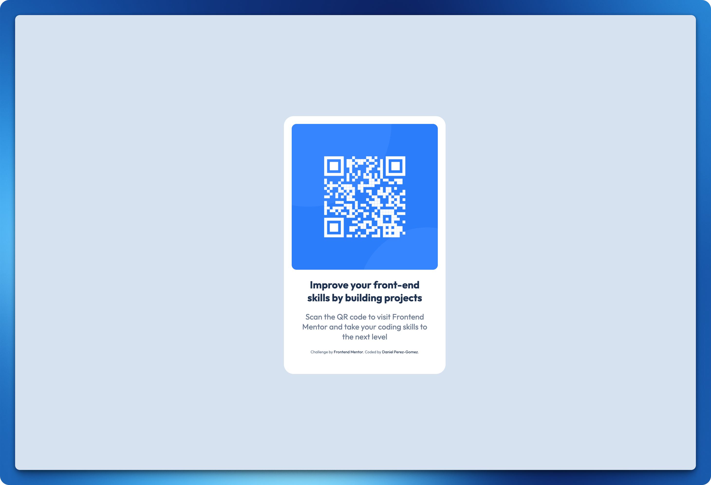

# Frontend Mentor - QR code component solution

This is a solution to the [QR code component challenge on Frontend Mentor](https://www.frontendmentor.io/challenges/qr-code-component-iux_sIO_H). Frontend Mentor challenges help you improve your coding skills by building realistic projects. 

## Table of contents

- [Overview](#overview)
  - [Screenshots](#screenshots)
  - [Links](#links)
- [My process](#my-process)
  - [Built with](#built-with)
  - [What I learned](#what-i-learned)
  - [Useful resources](#useful-resources)
- [Author](#author)

## Overview

### Screenshots
<div style="display: flex; flex-wrap: wrap; justify-content: center">
  
  
</div>

### Links

- Solution URL: [Link to my challenge solution on GitHub](https://github.com/danpgomez/qr-code-component-main)
- Live Site URL: [Live site for this challenge](https://danpgomez.github.io/qr-code-component-main/)

## My process

### Built with

- Semantic HTML
- CSS custom properties
- Flexbox
- Mobile-first workflow
- [Google Fonts: "Outfit"](https://fonts.google.com/specimen/Outfit)

### What I learned

Using CSS custom properties for reusable styles making the code easier to maintain.

```css
:root {
    --slate300: hsl(212, 45%, 89%);
}

.card h1 {
    color: var(--slate900);
}
```

### Useful resources

- [Frontend Mentor: Figma for Developers](https://www.frontendmentor.io/articles/figma-for-developers-how-to-work-with-a-design-file-m6CZKZ1rC1) - Extremely useful guide on working with Figma files as a developer 🤩!

## Author

- Website - [danieltalkscode.com](https://danieltalkscode.com/)
- Frontend Mentor - [@danpgomez](https://www.frontendmentor.io/profile/danpgomez)
- Bluesky - [@danieltalkscode.com](https://bsky.app/profile/danieltalkscode.com)
